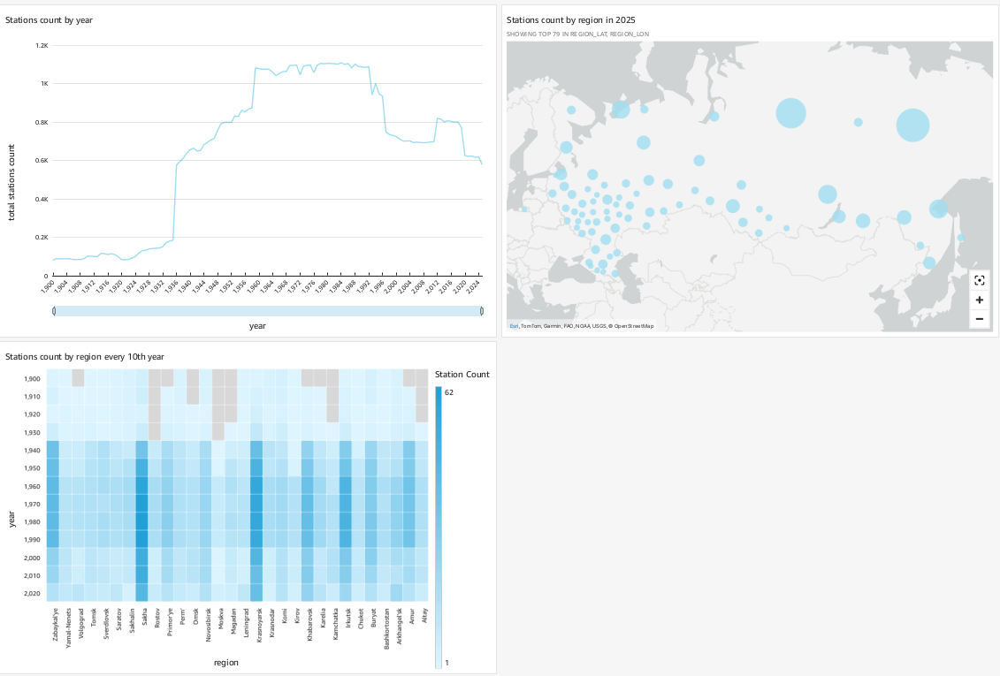
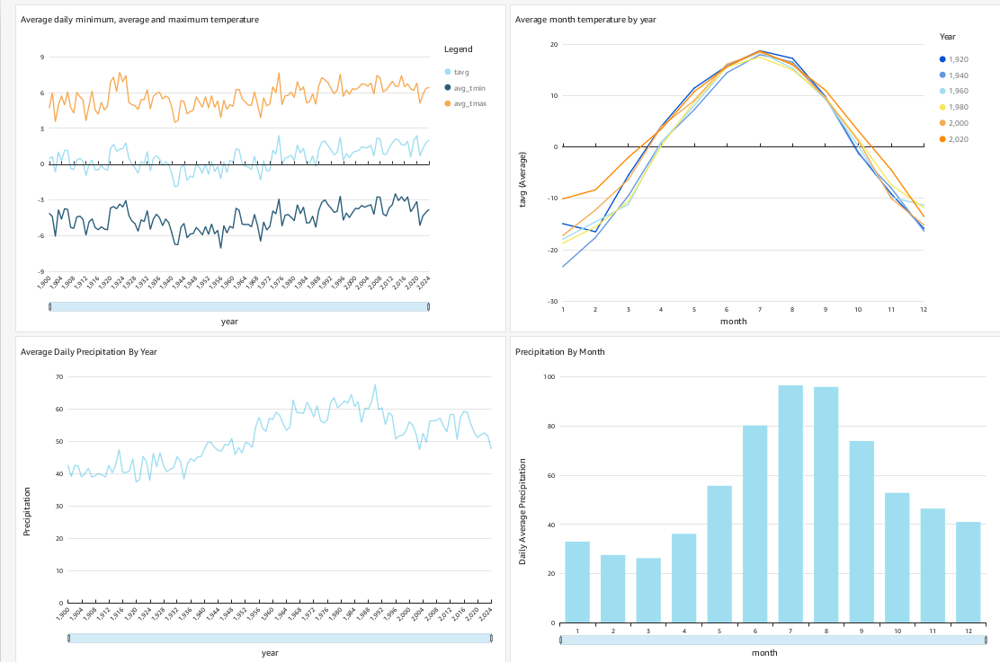
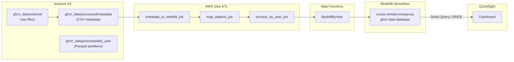

# Russia Historical Climate Data Pipeline

An end-to-end AWS data engineering pipeline for ingesting, processing, and visualizing historical climate data for Russia.

## Problem
The project is about how the Russian climate has changed for the last century.
Particularly, we are interested in 3 main variables: temperature, precipitation, and number of weather stations.
I chose [Global Historical Climatology Network Daily (GHCN-D)](https://registry.opendata.aws/noaa-ghcn/) dataset as the main data source.

The main objective is to:
- Develop a pipeline to collect the Russian climate archive data and process it in batch
- Build a dashboard to visualize the trends

## Dashboard





## 📖 Overview

This project automates the full lifecycle of climate data from NOAA’s GHCN, including:

1. **Ingestion** of raw data into S3  
2. **ETL** with AWS Glue (fixed-width → CSV, spatial joins, yearly partitioning)  
3. **Orchestration** via AWS Step Functions  
4. **Storage** in Amazon Redshift Serverless  
5. **Visualization** in Amazon QuickSight  

All infrastructure is defined in Terraform, and configuration values live in a single `config.yaml`.  

## 🏗 Architecture

  
*Figure 1: High-level data flow and AWS services.*



## 🔧 Components

- **AWS S3**  
  - `ghcn_data/external` (raw files)  
  - `ghcn_data/processed/metadata` (CSV metadata)  
  - `ghcn_data/processed/by_year` (partitioned Parquet)  
  - `scripts/` (uploaded ETL scripts)  
  - `logs/` (Glue Spark & Step Functions logs)  

- **AWS Glue Jobs**  
  1. **metadata_to_redshift_job** — fixed-width → CSV  
  2. **map_stations_job** — spatial join with GADM GPKG  
  3. **process_by_year_job** — yearly Parquet partitions + data quality checks  

- **AWS Step Functions**  
  - **BackfillByYear** Map state fans out `process_by_year_job` for 1901–2024  

- **Amazon Redshift Serverless**  
  - Namespace: `russia-climate-namespace`  
  - Workgroup: `russia-climate-workgroup`  
  - Schemas & tables loaded via SQL scripts in `sql_scripts/`  

- **Amazon QuickSight**  
  - Data source: Redshift Serverless (`ghcn-data` database)  
  - Templates & dashboards generated from analysis definitions in `quicksight/`  

- **Configuration**  
  - Single `config.yaml` holds all constants (region, bucket, usernames, ARNs)  
  - Consumed by Terraform (`yamldecode`), Python (`PyYAML`), SQL (Jinja2), and shell scripts (`yq` or Python one-liner)  

## ⚙️ Setup

1. **Clone repo**  
   ```bash
   git clone https://github.com/your-org/pipeline-automation.git
   cd pipeline-automation
   ```

2. **Configure**  
   - Edit `config.yaml` with your AWS account ID, QuickSight user, bucket name, etc.

3. **Terraform**  
   ```bash
   cd infrastructure
   terraform init
   terraform apply
   ```

4. **Upload ETL scripts & external data**  
   ```bash
   cd ../scripts
   ./upload_to_s3.sh
   ```

5. **Backfill historical data**  
   ```bash
   aws stepfunctions start-execution \
     --state-machine-arn arn:aws:states:eu-central-1:615299755921:stateMachine:BackfillByYear
   ```

6. **Publish QuickSight dashboards**  
   ```bash
   cd ../quicksight
   aws quicksight create-template \
     --aws-account-id $AWS_ACCOUNT_ID \
     --template-id monthly-agg-template \
     --source-entity file://monthly-agg-data-template-definition.json

   aws quicksight create-dashboard \
     --aws-account-id $AWS_ACCOUNT_ID \
     --dashboard-id monthly-agg-dashboard \
     --source-entity file://monthly-agg-data-template-definition.json \
     --permissions file://dashboard-permissions.json
   ```


## 📂 Directory Structure

```
pipeline-automation/
├── config.yaml
├── infrastructure/       # Terraform modules & main.tf
├── scripts/              # ETL & upload scripts
├── sql_scripts/          # Redshift DDL & COPY/INSERT scripts
├── quicksight/           # Template definitions & permissions
└── dashboards/           # PDF files with dashboard
```


## 🤝 Contributing

Feel free to open issues or pull requests—happy to collaborate!  
Contact: Edyarich <ymnik432@gmail.com>
